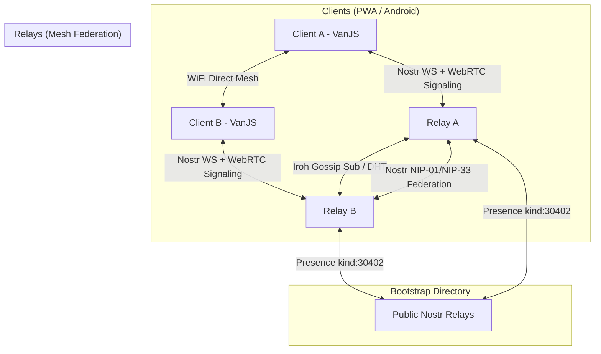

# saysheep — Decentralized Free-Stuff Geo-Marketplace

saysheep is a decentralized, offline-first marketplace for giving away and finding free stuff in local communities. Built on the Nostr protocol, it features a hybrid mesh synchronization layer powered by **Iroh Gossip** and **Nostr Federation**, paired with **Capacitor WiFi Direct** mesh networking for local offline sharing on Android.

---

## Architecture



### Key Technical Pillars
1. **VanJS Reactive Client UI**: Features a fast, zero-dependency reactive layout with a dynamic MapLibre GL / PMTiles map, reactive markers, notifications, settings, and instant alerts.
2. **Offline-First Storage**: Powered by IndexedDB on the client side with automatic geohash prefix area subscriptions. Stale replaceable events (kind: 30402 classifieds) are automatically pruned on new "taken" events.
3. **Nostr Protocol Core**: Employs standard Nostr protocols (NIP-01, NIP-09, NIP-12, NIP-33 replaceable events, and NIP-99 classified listings kind: 30402).
4. **Iroh Gossip Relay Sync**: Relays organize into a DHT k-bucket mesh network using `@number0/iroh` NAPI-RS bindings. Stored events are automatically gossiped to peer relays in the swarm.
5. **Decentralized Bootstrap Discovery**: Relays announce their public WebSocket URL and dynamic Iroh `NodeAddr` to public bootstrap Nostr relays (`wss://relay.damus.io`, `wss://nos.lol`) using kind 30402 presence events. Peer relays fetch these presence cards, register the peer addresses, and subscribe to the gossip swarm automatically.
6. **Capacitor Android WiFi Direct Plugin**: A custom Java plugin (`saysheep-wifidirect`) enables Android devices to discover each other and exchange listings peer-to-peer over local WiFi Direct without cellular/internet access.

---

## Directory Structure

- `client/`: The PWA frontend built with VanJS, MapLibre GL, and IndexedDB.
- `relay/`: The Node.js Nostr relay server featuring SQLite, P2P DHT routing, and Iroh Gossip.
- `plugins/saysheep-wifidirect/`: The Capacitor Android plugin for native WiFi Direct mesh networking.

---

## Installation & Setup

### Prerequisites
- Node.js (v22+)
- Android Studio & SDK (for Capacitor builds)

### Monorepo Setup
From the repository root, install dependencies:
```bash
npm install
```

### Run Frontend PWA
```bash
npm run dev
```

### Run Nostr Relay
```bash
npm run relay
```

---

## End-to-End Testing

saysheep includes a comprehensive multi-relay, multi-client E2E test runner to verify that listings successfully synchronize across the mesh network via public Nostr bootstrapping and Iroh Gossip.

To execute the test runner:
```bash
npm run test:e2e
```

---

## CI/CD and GitHub Repository Configuration

saysheep includes automated GitHub Actions pipelines to deploy client code, build and release the relay Docker image, and build signed Android binaries.

### Configure GitHub Pages
To configure the repository to deploy the client PWA directly via GitHub Actions:
```bash
gh api -X PUT /repos/sloev/saysheep/pages -f build_type=workflow
```

### Android Signing Secrets
To build signed production APK/AAB packages in GitHub Actions, you need to configure release signing secrets in your repository:

1. **Generate a signing keystore locally**:
   ```bash
   keytool -genkey -v -keystore release.keystore -alias saysheep-alias -keyalg RSA -keysize 2048 -validity 10000
   ```
2. **Base64 encode the keystore file**:
   ```bash
   base64 -w 0 release.keystore > keystore_base64.txt
   ```
3. **Upload the secrets via GitHub CLI**:
   ```bash
   gh secret set KEYSTORE_BASE64 < keystore_base64.txt
   gh secret set KEY_ALIAS -b "saysheep-alias"
   gh secret set STORE_PASSWORD -b "your_keystore_password"
   gh secret set KEY_PASSWORD -b "your_key_password"
   ```
