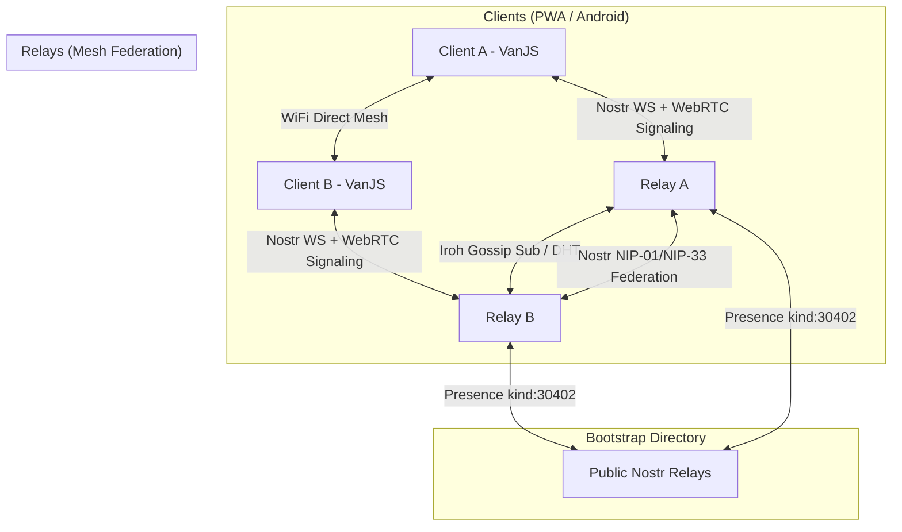

# saysheep — Decentralized Free-Stuff Geo-Marketplace

saysheep is a decentralized, offline-first marketplace for giving away and finding free stuff in local communities. Built on the Nostr protocol, it features a hybrid mesh synchronization layer powered by **Iroh Gossip** and **Nostr Federation**, paired with **Capacitor WiFi Direct** mesh networking for local offline sharing on Android.

---

## Architecture



### Key Technical Pillars
1. **VanJS Reactive Client UI**: Features a fast, zero-dependency reactive layout with a dynamic MapLibre GL / PMTiles map, reactive markers, notifications, settings, and instant alerts.
2. **Offline-First Storage**: Powered by IndexedDB on the client side with automatic geohash prefix area subscriptions. Stale replaceable events (kind: 30402 classifieds) are automatically pruned on new "taken" events.
3. **Nostr Protocol Core**: Employs standard Nostr protocols (NIP-01, NIP-09, NIP-12, NIP-33 replaceable events, and NIP-99 classified listings kind: 30402).
4. **Iroh Gossip Relay Sync**: Relays organize into a DHT k-bucket mesh network using `@number0/iroh` NAPI-RS bindings. Stored events are automatically gossiped to peer relays in the swarm.
5. **Decentralized Bootstrap Discovery**: Relays announce their public WebSocket URL and dynamic Iroh `NodeAddr` to public bootstrap Nostr relays (`wss://relay.damus.io`, `wss://nos.lol`) using kind 30402 presence events. Peer relays fetch these presence cards, register the peer addresses, and subscribe to the gossip swarm automatically.
6. **Capacitor Android WiFi Direct Plugin**: A custom Java plugin (`saysheep-wifidirect`) enables Android devices to discover each other and exchange listings peer-to-peer over local WiFi Direct without cellular/internet access.

---

## Security & Privacy

saysheep has no accounts or servers that hold your data — your identity is a Nostr keypair generated and kept on your device. A few properties and trade-offs are worth understanding:

- **Identity / key storage.** The secret key lives in `localStorage` (`saysheep_identity_v1`) as hex. The optional **passkey** (WebAuthn) gates the *export/reveal* of the key in Settings, but does not encrypt it at rest — anything with code-execution in the origin (e.g. a malicious browser extension) could read it. There is intentionally no XSS surface: all user content is rendered as text (VanJS escapes text nodes) and image tags are accepted only as `data:image/(png|jpeg|jpg|webp);base64,…`. *Future work: encrypt the key at rest with a WebAuthn-PRF–derived key.*
- **Private chat (NIP-44).** Item chat is end-to-end encrypted with NIP-44 (kind `1442`); only the two participants can read a message. Each message carries a small NIP-13 proof-of-work and is dropped on ingest below the difficulty threshold to deter spam, and the owner of a thread is verified against the real listing's pubkey so a sender cannot forge which item/owner a conversation belongs to.
- **Metadata trade-off.** To let relays and peers route and thread messages, the routing tags stay in clear text: recipient (`p`), item (`e`/`i`), owner (`o`) and a coarse geohash (`g`). The message *body* is encrypted, but an observer of a relay can see *who is talking to whom about which item* and the approximate area. If full metadata privacy is required, a NIP-17 gift-wrapped mode would hide this at the cost of relay-side `#p` filtering. *Considered future work.*
- **Spam & abuse.** Listings require NIP-13 PoW (difficulty 8); the relay additionally rate-limits to 60 events/window/IP and can screen images against a SHA-256 / perceptual-hash denylist (`moderation` in `relay.config.json`). Encrypted DM bodies cannot be server-moderated by design; clients can **block** a sender (mutes them and hides their listings/messages) or **report** a listing.

---

## How Relays Talk to Each Other

saysheep relays form a **leaderless mesh** — there is no central server, and any relay can join or leave at any time. Three independent gossip mechanisms run in parallel, so events still spread even if one path is blocked:

1. **Bootstrap discovery (via public Nostr relays).** On startup and every 10 minutes, each relay publishes a NIP-99 replaceable *presence* event (kind `30402`, tagged `t=saysheep-relay`, `d=saysheep-relay:<nodeId>`) to a set of public Nostr relays (default `wss://relay.damus.io`, `wss://nos.lol`). The presence card carries the relay's public WebSocket `url` and its Iroh `NodeAddr`. Each relay also *subscribes* to those same public relays for other `saysheep-relay` presence cards — so every relay learns the others' addresses with **no hardcoded peer list**. Discovered peers go into a Kademlia-style k-bucket routing table.

2. **Nostr federation sync (WebSocket pull / backfill).** Every `sync_interval_minutes` (default 30), a relay opens a WebSocket to each known peer, sends a `REQ` for kinds `[30402, 1, 5]` since its last sync watermark, and stores anything new. The request is narrowed by the geohashes the relay's own clients care about (`#g` filter), so a relay only pulls events relevant to its users.

3. **Iroh gossip swarm (real-time push).** All relays subscribe to one fixed gossip topic (`saysheep-nostr-v1`) over `@number0/iroh`. When a relay accepts a new event from a client, it immediately broadcasts it to the swarm; neighbours rebroadcast, so a valid event reaches the whole mesh in near real-time without per-peer connections. Iroh handles NAT traversal/hole-punching, seeded by the `NodeAddr`s found in the bootstrap presence cards.

**Net effect:** a listing posted to one relay is (a) pushed live to the Iroh swarm, (b) pulled by peers on their next federation tick, and (c) reachable to any *new* relay that discovers the network through the public bootstrap relays. Every relay independently verifies signatures, proof-of-work, and moderation before storing or forwarding, and de-duplicates by Nostr event id.

Clients connect to relays over standard Nostr WebSockets and can *also* exchange events directly browser-to-browser (WebRTC / Android WiFi Direct) — so the app keeps working peer-to-peer even with no relay reachable.

---

## Hosting a Relay

A relay is a small Node.js process (WebSocket server + SQLite + Iroh node). It is entirely optional — saysheep works against public Nostr relays out of the box — but running your own makes your local community's listings fast and resilient, and strengthens the mesh.

### Run from source
```bash
cd relay
npm install
npm start            # listens on :3001
```

### Run with Docker
```bash
cd relay
docker build -t saysheep-relay .
docker run -d --name saysheep-relay \
  -p 3001:3001 \
  -e PUBLIC_URL=wss://relay.example.com \
  -v saysheep-data:/app/data \
  saysheep-relay
```
The volume persists the SQLite database (`/app/data/relay.db`) **and** the Iroh node identity (`/app/data/iroh`) across restarts — keep it so your relay retains a stable node id in the mesh.

### Configuration

Settings live in `relay/relay.config.json`; each can be overridden by an environment variable:

| Env var | Config key | Default | Purpose |
| :-- | :-- | :-- | :-- |
| `PORT` | `port` | `3001` | WebSocket listen port |
| `PUBLIC_URL` | `public_url` | _(empty)_ | Your relay's public `wss://` URL. **Required to advertise to the mesh** — without it the relay still serves clients and pulls from peers, but won't announce itself. |
| `FEDERATION_PEERS` | `federation.peers` | `[]` | Comma-separated `wss://` peers to always sync with |
| `BOOTSTRAP_SEEDS` | `federation.seeds` | `wss://relay.damus.io,wss://nos.lol` | Public relays used for presence discovery |
| `SYNC_INTERVAL_MINUTES` | `federation.sync_interval_minutes` | `30` | How often to pull from peers |
| `MODERATION_ENABLED` | `moderation.enabled` | `true` | Image pHash + report-threshold screening |
| `DB_PATH` | — | `data/relay.db` | SQLite database path |
| `IROH_DATA_DIR` | — | `data/iroh` | Iroh identity/storage dir |

Spam control is built in: listing events must carry proof-of-work (`min_pow_difficulty_item` = 8 bits, 4 for chat), are rate-limited to 60 events/min per IP, signature-verified, and capped at 512 KB.

#### Rich link previews (optional)

Because GitHub Pages can't server-render per-item Open Graph tags, a shared item link normally unfurls only to the generic app. A **public, TLS-terminated relay** can serve them instead: the relay answers `GET /i/<d-tag>` with Open Graph meta (title, description, photo) and `GET /i/<d-tag>/image` with the photo as a real HTTP image (crawlers can't read the `data:` URL stored in the event), then redirects real browsers on to the PWA item page. Set `pwa_url` in `relay.config.json` to your deployed PWA URL, and build the client with `VITE_OG_BASE=https://relay.example.com` so the **Share** button hands out `/i/<d-tag>` links. Leave `VITE_OG_BASE` unset to keep sharing the plain PWA deep link.

### Put it behind TLS

Browsers require `wss://` (TLS) to connect from an HTTPS page. Terminate TLS with a reverse proxy forwarding to the relay's plain WebSocket port. Example nginx:
```nginx
server {
  listen 443 ssl;
  server_name relay.example.com;
  ssl_certificate     /etc/letsencrypt/live/relay.example.com/fullchain.pem;
  ssl_certificate_key /etc/letsencrypt/live/relay.example.com/privkey.pem;
  location / {
    proxy_pass http://127.0.0.1:3001;
    proxy_http_version 1.1;
    proxy_set_header Upgrade $http_upgrade;
    proxy_set_header Connection "upgrade";
    proxy_set_header X-Forwarded-For $proxy_add_x_forwarded_for;
  }
}
```
Then set `PUBLIC_URL=wss://relay.example.com` so peers discover you at the TLS endpoint. (The relay reads `X-Forwarded-For` for per-IP rate limiting.)

### Join the mesh & let clients use it
- **Mesh:** set `PUBLIC_URL`. On the next announce tick your relay publishes its presence to the bootstrap seeds and other saysheep relays pick it up automatically — no coordination needed. To pin specific peers regardless of discovery, list them in `FEDERATION_PEERS`.
- **Clients:** in the app, open **Settings → relay servers**, add `wss://relay.example.com`, and pick a connectivity mode (peers + relays / peers only / relays only).
- **Health & info:** `GET https://relay.example.com/stats` returns live peer/uptime/report stats; `GET /` (or `Accept: application/nostr+json`) returns the NIP-11 relay info document.

---

## Directory Structure

- `client/`: The PWA frontend built with VanJS, MapLibre GL, and IndexedDB.
- `relay/`: The Node.js Nostr relay server featuring SQLite, P2P DHT routing, and Iroh Gossip.
- `plugins/saysheep-wifidirect/`: The Capacitor Android plugin for native WiFi Direct mesh networking.

---

## Installation & Setup

### Prerequisites
- Node.js (v22+)
- Android Studio & SDK (for Capacitor builds)

### Monorepo Setup
From the repository root, install dependencies:
```bash
npm install
```

### Run Frontend PWA
```bash
npm run dev
```

### Run Nostr Relay
```bash
npm run relay
```

---

## End-to-End Testing

saysheep includes a comprehensive multi-relay, multi-client E2E test runner to verify that listings successfully synchronize across the mesh network via public Nostr bootstrapping and Iroh Gossip.

To execute the test runner:
```bash
npm run test:e2e
```

### User Stories & Automated E2E Tests

The client PWA features a full suite of automated browser tests (`run-browser-tests.js`) that verify all user stories and application features. Every test run generates a video recording of the user interactions.

| User Story | Automated Test Case & Actions | Latest Recording |
| :--- | :--- | :--- |
| **Locating Items** (Geo-Discovery) | Load map viewport, verify geolocation bounds, and confirm fallback to Copenhagen coordinates if GPS is unavailable. | [Latest Run Video](https://github.com/sloev/saysheep/actions/workflows/deploy.yml) (Artifact `browser-test-video`) |
| **Creating Listings** (Give Away) | Navigate to the give-away form, upload a photo, fill in title/description, add tags, and submit the listing. | [Latest Run Video](https://github.com/sloev/saysheep/actions/workflows/deploy.yml) (Artifact `browser-test-video`) |
| **Browsing Items** (List View) | Navigate to the list page, verify the newly created listing is displayed with correct metadata, and ensure dynamic filtering by active map viewport bounds. | [Latest Run Video](https://github.com/sloev/saysheep/actions/workflows/deploy.yml) (Artifact `browser-test-video`) |
| **Viewing Listing Details** | Open the listing's detail page, verifying item status, photo, description, tags, distance pill, and owner actions. | [Latest Run Video](https://github.com/sloev/saysheep/actions/workflows/deploy.yml) (Artifact `browser-test-video`) |
| **Claiming Items** (Mark as Taken) | Click "Take It", verify that the item updates status immediately in real-time, and that a "Taken" stamp is rendered. | [Latest Run Video](https://github.com/sloev/saysheep/actions/workflows/deploy.yml) (Artifact `browser-test-video`) |
| **Item Chat** (Direct Communication) | Open chat section, enter message ("Is this item still available?"), submit, and confirm message is appended to chat list. | [Latest Run Video](https://github.com/sloev/saysheep/actions/workflows/deploy.yml) (Artifact `browser-test-video`) |
| **Deleting Listings** (Listing Purge) | Owner deletes their listing, confirming the dialog, and verifying that the listing is removed from the store and redirects back. | [Latest Run Video](https://github.com/sloev/saysheep/actions/workflows/deploy.yml) (Artifact `browser-test-video`) |
| **Managing Agents** (Saved Searches) | From the list view, search and tap 🤖 to save the current search + map area as an agent, name it inline, then on `/agents` rename it, toggle notifications, edit (reopens it in the list view), and delete. | [Latest Run Video](https://github.com/sloev/saysheep/actions/workflows/deploy.yml) (Artifact `browser-test-video`) |
| **Configuration** (Settings Page) | Navigate to `/settings`, toggle language to Danish (verifying translation changes), toggle back to English, add a custom relay, and remove it. | [Latest Run Video](https://github.com/sloev/saysheep/actions/workflows/deploy.yml) (Artifact `browser-test-video`) |

To run the browser-based E2E test suite locally:
```bash
node run-browser-tests.js
```
The video recording will be saved to your local artifacts directory or `test-artifacts/browser_test_run.webm`.

---

## CI/CD and GitHub Repository Configuration

saysheep includes automated GitHub Actions pipelines to deploy client code, build and release the relay Docker image, and build signed Android binaries.

### Configure GitHub Pages
To configure the repository to deploy the client PWA directly via GitHub Actions:
```bash
gh api -X PUT /repos/sloev/saysheep/pages -f build_type=workflow
```

### Android Signing Secrets
To build signed production APK/AAB packages in GitHub Actions, you need to configure release signing secrets in your repository:

1. **Generate a signing keystore locally**:
   ```bash
   keytool -genkey -v -keystore release.keystore -alias saysheep-alias -keyalg RSA -keysize 2048 -validity 10000
   ```
2. **Base64 encode the keystore file**:
   ```bash
   base64 -w 0 release.keystore > keystore_base64.txt
   ```
3. **Upload the secrets via GitHub CLI**:
   ```bash
   gh secret set KEYSTORE_BASE64 < keystore_base64.txt
   gh secret set KEY_ALIAS -b "saysheep-alias"
   gh secret set STORE_PASSWORD -b "your_keystore_password"
   gh secret set KEY_PASSWORD -b "your_key_password"
   ```
